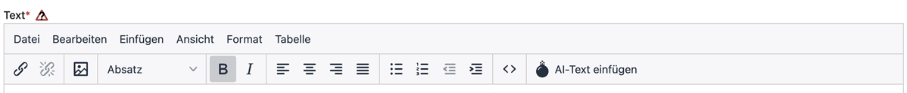

# Contao OpenAI Bundle

The purpose of this extension is to quickly and easily generate meta descriptions and titles from page content using ChatGPT (OpenAI). Page content also includes dynamic pages generated through the Contao News extension.

In the screenshot below you can see some settings to get you started with relatively good results.

```
This extension is also available for Contao 5.3+. See the 5.3 branch.
```

## Getting started

Install by hand / command line with
```
composer require vonheldenundgestalten/contao-openai-bundle
```
or through the Contao Manager interface.

Add this to the .htaccess of a project
```
RewriteCond %{REQUEST_URI} !^/_gpt*
```
## Compability

| Contao Version | PHP Version |
|----------------|-------------|
| ^5.3       | ^8.0 |


## Important note

- An OpenAI developer account is required. Sign up [here](https://platform.openai.com/signup). 
- The required token is also created [there](https://platform.openai.com/account/api-keys).
- There is a fee to use the OpenAI API. An overview of OpenAI pricing can be found here: [https://openai.com/pricing](https://openai.com/pricing)
- We tested a lot and so far we haven't gotten more than $5 a month

## TinyMCE Plugin notes


Please make sure you don't have a custom be_tinyMCE.html5 template. If so, take a look at src/Resources/contao/templates/be_tinyMCE.html5 and adjust the relevant places manually.

## Screenshots


## Default configuration

After installation, only the OpenAI API key is required for regular pages. The extension enables page articles, uses the Chat Completions endpoint with `gpt-5.6-luna`, and prefills ready-to-use prompts for SEO titles and descriptions, a temperature of `0.5`, and a maximum output of `300` tokens. All presets can still be changed in the Contao back end.

GPT-5.6 Luna is optimized for cost-sensitive, high-volume workloads. GPT-5.6 Terra and Sol are also available when a higher-capability model is preferred.

Headlines, rich text, HTML, code, lists, description lists, tables, accordion titles and bodies, captions, and other core descriptive fields are read automatically, including content elements nested inside accordions and element groups. Additional fields selected under **Custom fields** support plain values as well as nested PHP-serialized arrays; markup and structural headline metadata are removed before the page content is sent to OpenAI.

## Best practice


- Define a usage limit in the OpenAI API dashboard to control costs.
- english versions of the prompts would be:

For the title:
> Write a concise page title consisting of 5 to 6 words for the following text:
>
For the description:
> Write an informative/emphatic/appealing page description for the following text that contains less than 160 characters including spaces:
>

## How to use

- [ ] Insert the OpenAI API key. Model, prompts, temperature, and output length already have recommended defaults.
- [ ] Optionally adjust the model and generation presets.
- [ ] Set optional settings like hidden elements and custom fields
- [ ] optional: add "tl_news" to the allowed tables to active the buttons for the News
- [ ] Go to page settings and use the buttons below SERP preview
- [ ] Enjoy the magic :)

## To-Do

- [ ] Integrate token calculator (e.g. [GPT-3-Encoder-PHP](https://github.com/CodeRevolutionPlugins/GPT-3-Encoder-PHP))
- [ ] Content weighting through ChatGPT as pre-fetch event
- [ ] Define personality profile (role) for Chat completions API model
- [ ] Considerations and testing for the actual maximum character length for the request
- [ ] Make costs per Request more transparent (show used tokens and calculate with OpenAI pricing)
- [ ] do
- [ ] some
- [ ] [magic🪄](https://media.tenor.com/IOEsG9ldvhAAAAAd/mr-bean.gif)

## new Features
- v0.2.0 -> TinyMCE AI-Text generation Dialog
- v1.0.0 -> add Contao 5 compatibility 
- v1.1.0 -> Contao Backend Help Bot powered by CustomGPT

## Support
Contao OpenAI Bundle is a project for the community. Please consider giving feedback or creating pull requests to support the ongoing development.
